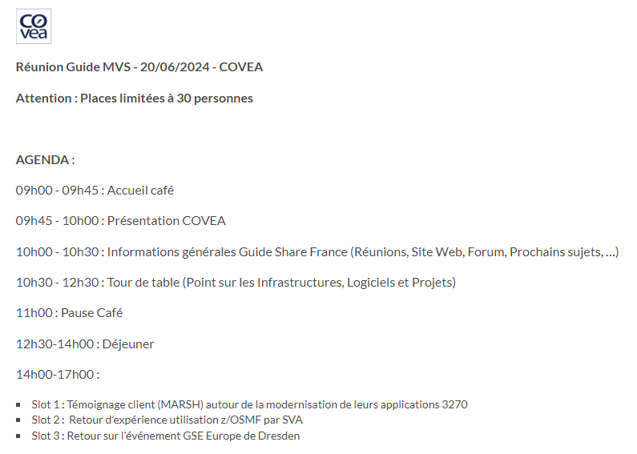
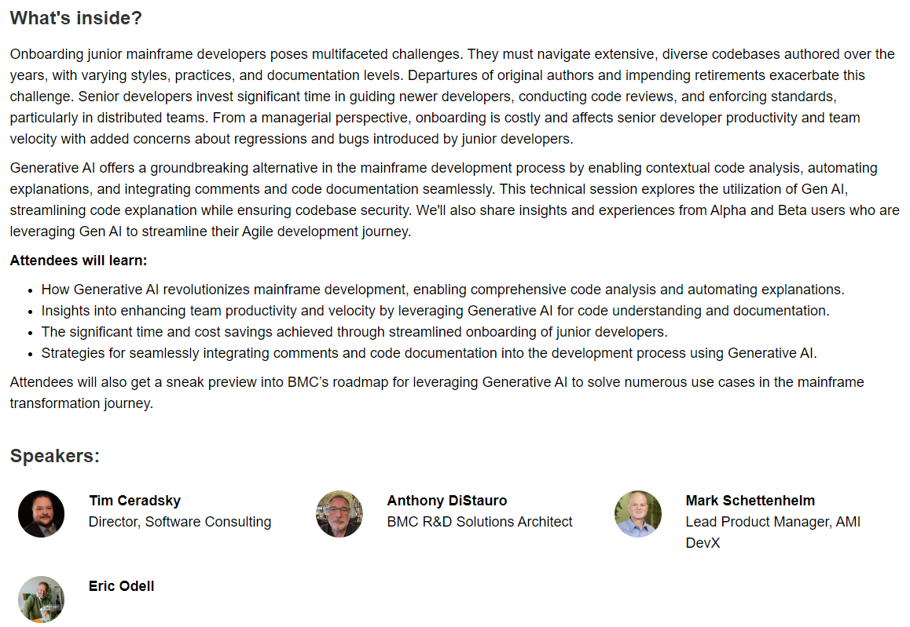
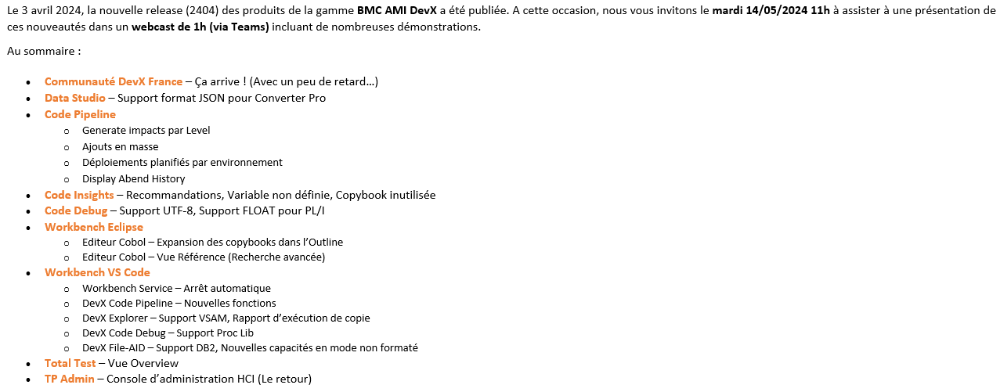

## Nouveautés à la Une

- Release 2404 des Produits DevX - 03/04/2024 - [Release Note Workbench for Eclipse](https://docs.bmc.com/docs/display/bmcmainframe/%28Updated%29+Release+notes%3A+Version+23.03.01+of+BMC+AMI+DevX+Workbench+for+Eclipse) | [Release Note Workbench for VS Code](https://docs.bmc.com/docs/display/bmcmainframe/Release+notes%3A+Version+24.4+of+BMC+AMI+DevX+Workbench+for+VS+Code)

## Evenements à Venir

- Guide Share MVS - 20/06/2024 - COVEA (Levallois-Perret) - [Lien vers l'événement](https://gsefr.org/en/calendar/index/index?id=243)

- Webcast Nouveautés DevX T3 2024 - Date à définir (Juillet)

## Evenements Passés

- Tech Talk GenAI : Streamlining Mainframe Development - 15/05/2024 - 53min - [Replay](https://events.bmc.com/streaming-mainframe-development?i=KqErFkSscDddhKBs-Zt0e96EfuwTaROT)

- Webcast Nouveautés DevX T2 2024 - 14/05/2024 - [Demandez le replay et/ou les slides](mailto:xavier_eraso@bmc.com)

