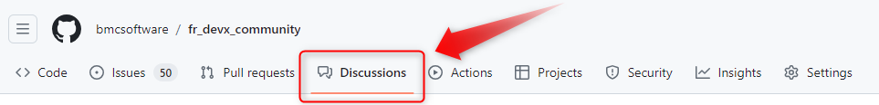

## Communauté des utilisateurs DevX France

Bienvenue dans la communauté DevX France, un espace privilégié de partage et co-création autour des solutions BMC AMI DevX. 

## Comment fonctionne la communauté ?

La communauté DevX France est hébergée dans un espace GitHub au sein de l'organisation BMC Software. Elle exploite le système des Pages GitHub pour offrir une expérience de navigation s'approchant d'un blog. Les éléments composant les pages sont créées par les admins de l'espace sur la base des contenus partagés par les membres de la communauté dans GitHub ainsi que des éléments externes telles que les idées soumises sur le site de la communauté BMC.

## Comment participer ?

La commaunauté est ouverte à tous les utilisateurs des solutions BMC AMI DevX. Pour participer, il faut disposer d'un identifiant GitHub et rejoindre l'organisation BMC Software en tant que membre. A noter qu'il n'est pas possible d'intéragir directement avec les pages GitHub, elles permettent uniquement d'exposer de façon synthétique les informations les plus pertinentes du moment. Les membres doivent utiliser la section "Discussions" du dépôt GitHub pour intéragir au sein de la communauté.

Il est important d'utiliser les sous-sections adéquates pour faciliter le report ultérieur dans les pages de la communauté :

- **Ideas** - Pour la co-construction d'idées à promouvoir auprès des product manager BMC AMI DevX
- **Q&A** - Pour toute question adressée à la communauté
- **Show and Tell** - Pour le partage d'astuces avec la communauté
- **General** - Pour tout ce qui ne rentre pas dans les catégories précédentes

## S'améliorer

Toute idée suceptible d'améliorer le fonctionnement de la communauté est la bienvenue, partagez votre avis tant sur le fond que sur la forme !