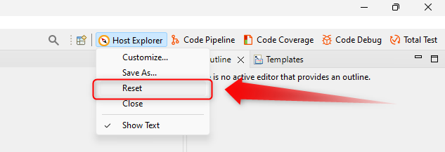
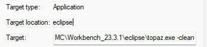

## Performances Workbench for Eclipse

Voici quelques astuces permettant d'améliorer les performances au démarrage d'Eclipse :

1. Indiquer l'emplacement du fichier jvm.dll dans le fichier .ini du Workbench


2. Modifier la valeur des paramètres Xss, Xms et Xmx (Valeur allouée à un thread, Minimum du Runtime Java Eclipse, Maximum du Runtime) dans le fichier .ini
3. Renseigne Xverify:none dans le fichier .ini (Désactive l'étape de vérification des class au démarrage, peut entraîner des instabilités si travail avec des projets java)


**Résultats observés :**

| Modification  | Durée de Démarrage avant Modification (s) | Durée de Démarrage après Modification (s) | Gain (s) | Gain (%) |
|:-|:-:|:-:|:-:|:-:|
| Ajout Emplacement jvm.dll | 10,7 | 7,1 | 3,6 | 33,6 |
| Augmentation Xss à 4096k | 10,7 | 10,7 | 0,0 | 0,0 |
| Augmentation Xms à 2048m et Xmx à 8192m | 10,7 | 10,2 | 0,5 | 4,6 |
| Xverify renseigné à none | 10,7 | 9,4 | 1,3 | 11,4 |

**Eléments complémentaires non mesurés :**

- Réduire la taille du workspace 
- Supprimer/Désactiver les plugins non utilisés

## Dépanner son Workbench for Eclipse

Que faire lorsque vous rencontrez un problème avec votre Workbench Eclipse ? Quelques astuces pour vous aider dans différentes situations du quotidien :

1. Penser à créer des sauvegardes régulières de son Workspace. Pouvoir avoir un backup en cas d'altération irréversible.

2. Si vous avez altérer par mégarde une perspective vous pouvez récupérer son format d'origine en cliquant droit sur l'onglet de la perspective active et choisissant "Reset".



3. Si votre Workbench se fige, un simple redémarrage peut suffire à résoudre le problème.

4. Si votre Workbench présente un comportement étrange, des erreurs à répétition ou des vues qui ne répondent plus correctement, il se peut qu'il y ait un problème dans la résolution des dépendances. Dans ce cas, il convient d'effectuer un redémarrage en mode "-clean" pour relancer une résolution globale des dépendances. 2 methodes possibles :
    - Créer un raccourci du fichier .exe du Workbench et ajouter " -clean" dans le de chemin

    

    - Ajouter -clean au début du fichier .ini du Workbench

```exemple
    -clean
    -startup
    plugins/org.eclipse.equinox.launcher_1.6.400.v20210924-0641.jar
    --launcher.library
```

!> L'option "-clean" peut ralentir considérablement votre Workbench. Il est conseillé de redémarrer en mode normal une fois l'opération effectuée.

5. Consulter les consoles à la recherche de messages d'erreur. De nombreux plugins disposent de leurs propres consoles dans lesquelles sont répertoriés les messages d'anomalie. Ces derniers peuvent fournir des indices précieux pour résoudre un problème lié à un plugin spécifique.

6. Afficher la vue "Error Log". Cette vue permet d'afficher les errueurs survenant dans les plugins ou tout simplement au sein de la plateforme Eclipse. Il espossible d'afficher le détail contenu dans la stack ce qui peut permettre d'établir l'origine du problème.

7. Utiliser Google ou Stack Overflow. Bien que de moins en moins utilisée, le Workbench Eclipse bénéficie d'un grand nombre de partage d'expérience divers sur le web. Il est assez fréquent de trouver la solution à un problème via de simples recherches. Cela peut être aussi complémentaire des 2 points précédents.

8. Si votre Workbench ne démarre plus du tout, cela peut résulter d'une corruption du Workbench.xmi. Ce fichier agit comme un gestionnaire de cookies de votre Workbench. Dans certains cas, un arrêt brutal du Workbench peut créer une altération de ce fichier ce qui peut bloquer tout démarrage de votre Workbench. Pour corriger cela, il convient de supprimer ce fichier de votre workspace, ce dernier sera automatiquement recréé au prochain démarrage puis alimenter en fonction de votre activité. Ce chichier se trouve dans votre workspace à l'emplacement suivant : "..\workspace\.metadata\.plugins\org.eclipse.e4.workbench".