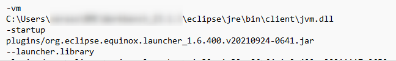

# Performances Workbench for Eclipse

Voici quelques astuces permettant d'améliorer les performances au démarrage d'Eclipse :

1. Indiquer l'emplacement du fichier jvm.dll dans le fichier .ini

2. Modifier la valeur des paramètres Xss, Xms et Xmx (Valeur allouée à un thread, Minimum du runtime Java Eclipse, Maximum du Runtime) dans le fichier .ini
3. Renseigne Xverify:none dans le fichier .ini (Désactive l'étape de vérification des class au démarrage, peut entraîner des instabilités si travail avec des projets java)

**Résultats observés :**

| Modification  | Durée de Démarrage avant Modification (s) | Durée de Démarrage après Modification (s) | Gain (s) | Gain (%) |
|:-|:-:|:-:|:-:|:-:|
| Ajout Emplacement jvm.dll | 10,7 | 7,1 | 3,6 | 33,6 |
| Augmentation Xss à 4096k | 10,7 | 10,7 | 0,0 | 0,0 |
| Augmentation Xms à 2048m et Xmx à 8192m | 10,7 | 10,2 | 0,5 | 4,6 |
| Xverify renseigné à none | 10,7 | 9,4 | 1,3 | 11,4 |

**Eléments complémentaires non mesurés :**

- Réduire la taille du workspace 
- Supprimer/Désactiver les plugins non utilisés
