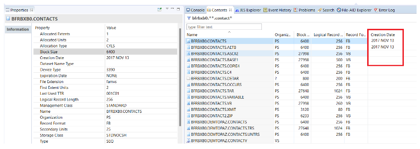
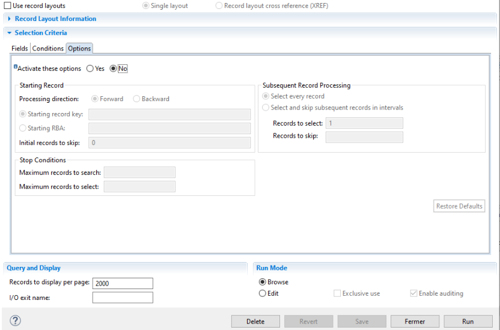
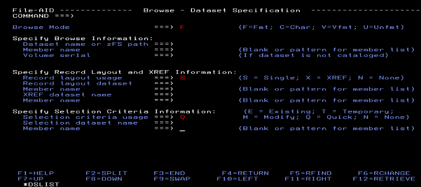
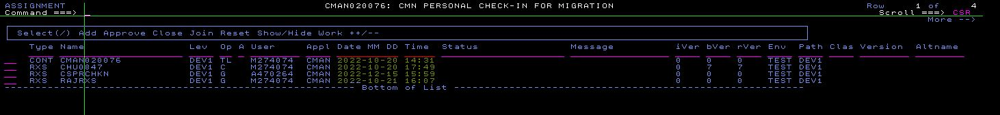

## Liens directs 

?>[AMI DevX](https://community.bmc.com/s/topic/0TO3n000000FWZmGAO/bmc-ami-devx?tabset-19d80=812de) | [Abend-AID](https://community.bmc.com/s/topic/0TO3n000000RjuQGAS/bmc-ami-devx-abendaid) | [DevEnterprise](https://community.bmc.com/s/topic/0TO3n000000RjuRGAS/bmc-ami-devx-deventerprise) | [File-AID](https://community.bmc.com/s/topic/0TO3n000000RjuSGAS/bmc-ami-devx-fileaid) | [Code Pipeline](https://community.bmc.com/s/topic/0TO3n000000RjuTGAS/bmc-ami-devx-code-pipeline) | [Workbench for Eclipse](https://community.bmc.com/s/topic/0TO3n000000RjuVGAS/bmc-ami-devx-workbench-for-eclipse) | [Workbench for VS Code](https://community.bmc.com/s/topic/0TO3n000000SYbcGAG/bmc-ami-devx-workbench-for-vs-code) | [Code Debug](https://community.bmc.com/s/topic/0TO3n000000RjuWGAS/bmc-ami-devx-code-debug) | [zAdviser](https://community.bmc.com/s/topic/0TO3n000000RjuXGAS/bmc-ami-zadviser?tabset-19d80=812de)

Pour proposer des idées et co-construire des idées avec la communauté : [Idées de la communauté](https://github.com/bmcsoftware/fr_devx_community/discussions/categories/ideas)

## Liste des Idées Actives

?>Dernière mise à jour 10/03/2025

### DevX

| Titre | Description | Votes | Statut | Date de Création |
|:-|:-|:-:|:-:|:-:|
| [CWDDALLU: provide a fix for interoperability with multi-volume SMS storage class](https://community.bmc.com/s/idea/087cx000001QlvZAAS/detail) | I request a fix to enable interoperability of CWDDALLU (EXPORT/DIRS/IMPORT - reports & source listings) with a multi-volume SMS storage class.   Even though a dataset may span up to 20 volumes due to their multi-volume SMS storage class, they usually only span a single volume, but there have been cases where a dataset has been split across two volumes.   When a dataset of an EXPORTed report has been split across two volumes, the DIRS command exits with a CXUTL3026S/BSAM0020 error (see case 01812693).  Then when a dataset for which the DIRS command produces a CXUTL3026S/BSAM0020 error is packaged by XMIT for transfer to BMC, the received dataset is single-volume causing BMC's attempt to reproduce the anomaly to fail.   Since it has been 20 years now that a product like ISPF can correctly handle multi-volume files under zOS, generally the z/OS user does not want to have to check and ensure that a dataset of an EXPORTed report involved in CWDDALLU is single volume and not multi-volume.  I see this lack of interoperability as a product anomaly.   Even though the dataset usually only span a single volume, there is at least one way to test, applicable when the dataset size exceeds 17 TRK, by causing the creation of a multivolume file.  For example for a dataset of Size=326 TRK,  -start by performing the calculation : (Size=326-1)/15=21,7 and note 21, which is the integer part of the result.  -Ensure that an error occurs when trying to copy the dataset to a dataset allocated with SPACE=(TRK,(1,21)),VOL=(,,,1)  -Ensure with LISTDS that you obtain a multivolume dataset after copying with SPACE=(TRK,(1,21)),VOL=(,,,2).   To help BMC move toward supporting multi-volume files that a product like ISPF has already supported for 20 years,  I've described a way to test CWDDALLU with a multi-volume dataset,  I request the removal of "Importing from multi-volume data sets is not supported" from the documentation https://docs.bmc.com/docs/display/bcecc1702/Commands+for+all+DDIO+files ,  and I request a fix to enable interoperability of CWDDALLU (EXPORT/DIRS/IMPORT) with a multi-volume SMS storage class. | 3 | New | 02/12/2024 |
| [CWDDALLU/IMPORT/TODD Provide a way to keep/reuse the allocates of the databases](https://community.bmc.com/s/idea/087Kj0000001Lj1IAE/detail) | I request a way to keep/reuse the allocates of the databases without them being freed/reallocated during each import command.   On z/OS, when a dynamic database allocation is performed at a JCL step, the JESYSMSG trace includes one IGD103I line and one IGD104I line.  When the CWDDALLU program performs 1000 dynamic allocations of the same database to process 1000 IMPORT commands, 1998 lines (999 IGD103I + 999 IGD104I) resulting from repeated allocations of this database are in excess compared to a target situation where a single initial dynamic allocation of the database would be enough to process 1000 IMPORT commands.  When 100 databases are attached to the SHRDIR to which the 1000 IMPORT commands are processed, there are 199800 excess rows (99900 IGD103I + 99900 IGD104I) which clutter the JESYSMSG trace, compared to a target situation where a single initial dynamic allocation of each of 100 databases would be enough to process 1000 IMPORT commands.   The ddname ABNLTO$$ (since the ddname ABNLTO$$ is not currently used by CWDDALLU) could be reserved for this new behavior to keep the allocates of the databases without them being freed/reallocated during each import command.  When a JCL DD statement ABNLTO$$ is provided to CWDDALLU (//ABNLTO$$ DD DISP=SHR,DSN=<SHRDIR>), I request that CWDDALLU starts with a single initial dynamic allocation of the databases that are attached to the ABNLTO$$ shrdir, and ceases to free/reallocate these databases during each subsequent IMPORT command when parameter TODD=ABNLTO$$ is provided.  I expect the new feature to be developed in a way that keep (no impact) the dynamic free/allocate of the databases when parameter TODSN=<SHRDIR> is provided to an IMPORT command instead of parameter TODD=ABNLTO$$.  With the new behavior, when 100 databases are attached to the SHRDIR to which the 1000 IMPORT TODD=ABNLTO$$ commands are processed, I expect the JESYSMSG trace to includes only 100 IGD103I line and 100 IGD104I line resulting from the single allocation of each of 100 databases. | 2 | Declined | 22/08/2024 |
| [Use of Abend-Aid/Xpediter on a program whose source listing is in DWARF format](https://community.bmc.com/s/idea/087Kj0000001LT3IAM/detail) | The Cobol compiler is now able to produce a "source listing in Dwarf format", a format widely used under UNIX.  The dwarf format may be put in a PDSE.  If CWDDALLU/Abend-Aid/Xpediter could read dwarf format, it would allow replacing source VSAMs (SHRDIR and DBs) with PDSEs, which could be easier to administer than VSAMS (there is no known barrier limiting the number of members a PDSE could accommodate). | 5 | Not Planned (18 Months) | 17/07/2024 |
| [Small additions to CWDDALLU to make it easier to empty and detach an old databas](https://community.bmc.com/s/idea/087Kj0000001LS0IAM/detail) | To make it easier to empty and detach an old database I wish a "SUM OF SIZE(K)" property under DIR, a new "TOP=n" option to select the oldest sources listing in a database, a new new "AVAILABLE ALLOCATION K" under DIRX, and a new option "UNIT=K" under DIRX.   Not only is the use case "how to empty and detach an old database" not documented, but difficulties can arise because there are missing functions/properties in DIR/DIRX and MOVE/EXPORT.   I wish the following new features/properties :  - A new "SUM OF SIZE(K)" property, which is missing after the "SHARED DIRECTORY ENTRIES SELECTED:" line of the DIR report.  - A new "TOP=n" option (DIR, MOVE, EXPORT) to select the oldest source listings from a database is missing (select the x source listings from the database with the smallest ReportNumber)  - A new "AVAILABLE ALLOCATION K" property under DIRX which would tell me whether the space available in a database (recent) is sufficient to receive the <TOP=1000> oldest sources listings existing in a database (old) that I wish to empty and detach from SHRDIR.  - A new "UNIT=K" (DIRX) option (with default value UNIT=GROUPS) would be usefull to get the following properties of DIRX to be expressed in K rather than in GROUPS : "ALLOCATION GROUPS", "USED ALLOCATION K", "LARGEST MEMBER SIZE (IN K)", "SMALLEST MEMBER SIZE (IN K)", "AVERAGE MEMBER SIZE (IN K)", "MAXIMUM ALLOCATION K", "AVAILABLE ALLOCATION K" | 5 | In-Plan (18 Months) | 15/07/2024 |
| [On a list of files, add the dates columns in the contents view](https://community.bmc.com/s/idea/0873n000000Tl7TAAS/detail) | From the Host Explorer, on a list of files (from a filter), add the dates columns (creation, reference) in the contents view, to be able to sort the list on those columns.  The whole content of the "Properties" view" (or of the "Data Set Information" screen in TSO) must be able to be found (optionally) in the "Contents view". | 4 | Active | 28/10/2022 | 

### Abend-AID

| Titre | Description | Votes | Statut | Date de Création |
|:-|:-|:-:|:-:|:-:|
| [AbendAID Webhook - enhance visibility](https://community.bmc.com/s/idea/087cx000002M5j3AAC/detail) | Actually, when you create a webhook for abend-aid, it's impossible to know on when lpar is linked.  If it's activated or if it's attached to multiples lpar   It's need to have a better way to manage abend-aid webhook. Actually, it's too poor to manage it correctly | 1 | In-Plan (18 Months) | 05/03/2025 |
| [Abend-AID webhook - trap all duplicate (dup deleted also)](https://community.bmc.com/s/idea/087Kj0000001LmUIAU/detail) | If you have activated the delete duplicate in abend-aid (you didn't need to have a report each time the same abend occur) and you want to have an abend-aid webhook triggered, it's impossible, actually. You need to keep all the abend-aid report and didn't remove the duplicate.   As, if you have a duplicate, the abend-aid report block you have in the jes ouput point to the first report, for me, it's also possible to have a webhook triggered. | 1 | New | 04/09/2024 |
| [Abend-AID webhook - impossible to trap *all* the abend-aid report](https://community.bmc.com/s/idea/087Kj0000001LmPIAU/detail) | Actually, when you want to add a abend-aid webhook to trap all the abend that can occur on an lpar (example: trap all the production abend), it's impossible.  You can have a filter on the program name like A*, B*, ... but no "*" only.   Is it possible to add this functionnality? | 1 | In-Plan (18 Months) | 04/09/2024 |
| [Make possible the automatic recompilation of missing source listings](https://community.bmc.com/s/idea/087Kj0000001LTDIA2/detail) | If automatic recompilation of missing source listings was possible, we might avoid keeping some unused previous versions of source listings... | 3 | New | 17/07/2024 |
| [Add JES output in Abend-AID report](https://community.bmc.com/s/idea/087Kj0000001JgWIAU/detail) | Actually, we have a tool that capture the JES output of and abended program?  We try to use Abend-AID to replace this homemade tool. But, we didn't see any capability to capture the JES output when abend-aid take the hand.   So, for me, it's something relevant to have access to the jes output when something wrong happen.  Can we have a capability to save the jes output somewhere? Maybe in another dataset than the DDIO. | 2 | In-Plan (18 Months) | 03/06/2024 |
| [Match Storage of an SVC dump to the TGT, CEE , working storage cobol program](https://community.bmc.com/s/idea/0873n000000LiXnAAK/detail) | When we took a console dump or have an SVC dump, it will be useful to map "DSECT" TGT and CEE of a Cobol program. Also same problem for the working storage.  On listing compilation of the Cobol program whe have the definition of this different eye catcher and working storage definition.  The idea is to match Storage of the dump to the eye catcher TGT and CEE description fields, so we can know easily the working storage size, where are located different storage etc ... | 3 | In-Plan (18 Months) | 13/12/2023 | 
| [Better ESS integration with Abend-AID and ISPW](https://community.bmc.com/s/idea/0873n000000LiWzAAK/detail) | We have a question and no answer :) for our AAviewer.   If you want to check an old abend-aid report and the load is recompiled, it's impossible to do it.... Trying to force the ESS listing of the current load is not possible.  The only solution you have for now is: https://community.bmc.com/s/idea/0873n000000Tf8BAAS/detail.   But, in this case, you need to do manually the lock of the abend-aid to save the load module. What happens if you didn't lock it? You lose this capability.   After a discussion with the support, the only solution actually is to create a new DDIO file and store the ESS listing in it when you deploy a load. So... you have a copy of the ESS inside the load and n copy inside another DDIO. At the end, per LPAR, you can have from 2 to n time the space consumed by the DDIO/ESS space. Another problem is... what is the benefit of ESS if you need to export this information to keep it valuable?   One solution I see (for my use case), is the fact that we also have ISPW. AA can ask ISPW the load module from the warehouse and, send it. More link between AA and ISPW can be a very huge benefit! | 2 | Not Planned (18 Months) | 12/12/2023 | 
| [Display wrong memory address](https://community.bmc.com/s/idea/0873n000000LiUZAA0/detail) | According case : A1694947.  I capture and SVC dump and want to analyze this dump with abendaid rather than IPCS.  If the address is a 31 byte address but the cursor field point at 24 bytes address or less, so Abendaid displays the content of memory at 24 byte address and not 31 bytes address.   This is certainly normal, but a small warning would be welcome to avoid confusion for user.   I understand that it is historical but I don't understand why to display a 24 bytes memory when the address is 31 bytes. | 3 | Delivered | 30/11/2023 | 
| [$$CWINST : Ask for Version, Timestamp or ID on installer $$CWINST](https://community.bmc.com/s/idea/0873n000000DL7uAAG/detail) | To be sure to have to download, or not, the installer $$CWINST, it would be usefull to be able to identify it (version, Timestamp YYQQQ, or else) so we know whether the generated JCLs will provide us the last level of the maintenance or products (for any BMC DEVX products, Common code, Abend-Aid, File-Aid, Strobe, etc). Thanks you all | 1 | Active | 07/09/2023 | 
| [Custom INFO parameter for Action Definitions](https://community.bmc.com/s/idea/0873n000000TfJhAAK/detail) | When a CICS DUMP is trapped by Abend-Aid, you can configure in Abend-Aid the possibility of triggering a job (Action Definition Menu).  This allows for example to warn the owner of the program and invite him to consult the Abend-Aid report. We use the INFO parameter for that.  In the "Action Definition Menu" part, it is possible to customize the job card, the PROC to be executed but not the INFO parameter.  This INFO parameter contains the main characteristics of the DUMP report (Job Name, Abend Code, Tran, Program, ...) but it lacks a characteristic which is the "calling program" (called LOAD MODULE in Abend-Aid Viewer).  This feature is essential for CICS DUMPs under LE. Without this information on the "calling program", we cannot determine the owner of the business program because the program in the case of a CICS DUMP under "LE" is generic.   The request is to be able to customize this INFO parameter with the characteristics available to Abend-Aid (including the calling program "(LOAD Module)).  For more information: Case 01200861 | 2 | Active | 02/04/2021 | 
| [Abend-Aid Export parameters in a sequential dataset](https://community.bmc.com/s/idea/0873n000000TfGnAAK/detail) | Abend-Aid Enhancement (CWE-143642).  We would be interested in a request for improvement. That we can access (and modify) at least the parameters related to the DUMP Capture without the Viewer.   By an export, import mechanism or that these parameters are directly accessible in a sequential file (parmlib). | 3 | Active | 24/04/2020 | 

### DevEnterprise

| Titre | Description | Votes | Statut | Date de Création |
|:-|:-|:-:|:-:|:-:|
| [HCI PURGE is not precise](https://community.bmc.com/s/idea/0873n000000TfGHAA0/detail) | When you use HCI PURGE,ENQ=[PDS], you can't specify a specific member.  At the end, when you have only one file blocked, you "kill" all the enqueue on all the opened file in this PDS.   Can you add 2 possiiblities:  1. PURGE ENQ=SOMETING(FILE)   2.PURGE USER=USERID.   First one to purge an enqueue on a specific file.  Second one to purge all the enqueue for a specific user | 4 | Active | 21/10/2020 | 
| [Modernize DevEnterprise GUI](https://community.bmc.com/s/idea/0873n000000Tf0JAAS/detail) | DevEnterprise has a very old GUI. It's not very effective and completely outside all the other Compuware ecosystem. Can you provide a Topaz perspective for this tools, and modernize the look and feel. | 4 | Not Planned (18 Months) | 11/12/2019 | 

### File-AID

| Titre | Description | Votes | Statut | Date de Création |
|:-|:-|:-:|:-:|:-:|
| [DB2 explain in Topaz (Eclipse and VSCode)](https://community.bmc.com/s/idea/087cx000001VEhFAAW/view) | Actually, the db2 explain tooling of file-aid/DB2 is only working in 3270.  When our developers want to do an explain they need to go back to TSO.  It's more efficient if they can use the same tool (Eclipse of VSCode) to do the explain itself.| 2 | New | 09/12/2024 | 
| [upgrade File-aid to specify octet of begining to read on a row.](https://community.bmc.com/s/idea/0873n000000LicEAAS/detail) | Hi BMC community,    I want to suggest an evolution :   I have a copy and I want to read a file with this mapping. But the copy doesn't match completely with the file. (the file's got 100 octets previous on each row)   So I search a way with File Aid to skip the first 100octet ....and File Aid doesn't allow me to do that :'( (Or I didn't get it with XREF or other) (Yes, I could rebuild my file, or create an other copy who encapsulate my first one. but it's a contournement)  Furthermore, this evolution could also, -Skip octets at the begining -Show unformated begenning octets and Start the mapping after -Concate two or more copy to describe a file -Omit some other octet inside or at the end, in the way to match the copy with the file   Maybe this evolve could be shown in the panel Options in topaz      and on TSO on this panel (like the Quick option)    | 1 | Active | 10/01/2024 | 
| [Integration between File-AID and Code Pipeline](https://community.bmc.com/s/idea/0873n000000LiV8AAK/detail) | I have 2 kinds of use case in my mind for this kind of integration.  FA/MVS:  If you want to use FA/MVS and a copybook to read a file, you need to have it on the LPAR. But, if you have Code Pipeline, the source is not deployed, it stays inside Code Pipeline repository, maybe in another LPAR.  FA/IMS: Same problem for the DL1 copybook.   Actually, the only solution is to deploy the source on every lpar, so it's not very efficient. If we can have a link between Code Pipeline and ISPW, we can say "use this copybook to read this file", and the file is taken from the repository and use to do the operation.| 1 | Active | 4/12/2023 |  
| [HCI/Data Studio/File-AID: Group of CXSS* STC instead of dynamic CXSS* STC](https://community.bmc.com/s/idea/0873n000000Tf0uAAC/detail) | Currently, several hundred (thousand) CXSS* STC are launched dynamically per day to do File-Aid via Topaz  Another option would be to have a permanent STC group in LPAR (variable managed by a parameter). This would reduce CPU consumption and facilitate LPAR management | 4 | In-Plan (18 Months) | 04/02/2020 | 

### Code Pipeline

| Titre | Description | Votes | Statut | Date de Création |
|:-|:-|:-:|:-:|:-:|
| [REST API - get the "QP" content](https://community.bmc.com/s/idea/087cx000001NZR7AAO/detail) | Actually, in the REST API, it's not possible to get the "QP" content of a task.  I want to get the part generated and all the information related to theses part.   At least:  PartType, Class, PartName | 1 | New | 26/11/2024 | 
| [REST API: Promote a Release, you can't select multiples level](https://community.bmc.com/s/idea/087Kj000000wojWIAQ/detail) | We try to use the REST API promote for the release (/ispw/{srid}/releases/{releaseId}/tasks/promote).   In our case, the release can contain task from different level.  The release container is used for push from acceptance to production.   In this case, we have level such as ACCM, ACCR, ACC1, ACC2.  The release can contain components from every level.   We try to use the ACC* in the level parameters, but it's not accepted.   So, how can we manage this kind of situation? | 3 | New | 14/10/2024 |
| [Better OMVS support in Code Pipeline](https://community.bmc.com/s/idea/087Kj0000001LS5IAM/detail) | Code Pipeline do a good job for managing MVS files.  Actually, we have more and more objects to deploy on the OMVS part. zOSConnect, Python, Go, Java, ...  Some of them can fill the way Code Pipeline work with the MVS file. One task = one file.  But, when you start to work with more complex structures with a lot of file and directory like a Python application, it's nearly impossible to manage it directly in Code Pipeline.  At best, you need to manage a zip file and do the deployment with a lot of extra work.   Long time ago, Code Pipeline have some capabilities to manage directory and do the deployment of these kinds of complex structures.  Now, the documentation didn't mention anything about that.   As the mainframe is moving more and more to the omvs part, it's maybe time to do something on this way. Develop some functionality to manage complex OMVS structure, at least for the deployment, but also maybe for the source code management! | 3 | New | 16/07/2024 |
| [checking the version of a copybook used in all generated programs](https://community.bmc.com/s/idea/087Kj0000001JXDIA2/detail) | Hello   In order to be sure that for all programs using a copybook, the generate (compilation) has been done with the the last version, it will be great to have a command or utility providing such informations.  For example with the name of the copybook in entry and for the result the list of all generate programs, the version of the copybook used, the level, etc.   Or maybe the other way to search could be to be able to check that previous versions of a copybook are not anymore in used the map building of active tasks programs ?    N.B.  The analysis function can give the list of programs which are using the coybook using the cross-reference on the sources but doesn't give information about the generate and version of copybook.  The Impact functions (view impact, generate impact) on a copybook doesn't give this information  The QM (Query map) function on a version of a program can give the list of all copybooks and their version used during the generate.  But it's only for one program. | 3 | New | 30/05/2024 |
| [Info and export about code pipeline licences and user in BMC Web Client](https://community.bmc.com/s/idea/0873n000000LioKAAS/detail) | hello,  In the web client BMC (Compuware) installed on customer site you can see BMC installed products (code pipeline, Strobe, etc.) , ti manage approvals and deploiement of code pipeline, to do some administration tasks, etc.   It would be useful for code pipe line to :  - Have the information of the number of licence (active users "C" / maximum licences allowed)  - Have the informations of the users declared (userid, name, etc.) in code pipeline user database and being able to filter on every column USER_STATE, USER_ID, etc.)  - Being able to do an export of those users with all informations for exemple in a csv format.   If it's not possible in the web client. Why not to add this in Eclipse plugin ? | 2 | Active | 16/02/2024 |
| [Python API for Code Pipeline](https://community.bmc.com/s/idea/0873n000000LiWGAA0/detail) | I start to use Python on z/OS instead of REXX.   Actually, when I want to manage some Code Pipeline stuff with Python, I need to pass in the REST API on the CES server. And, if this server is down (for any reason), we lost the Python capability.   It can be more efficient (and more error proof) to have a direct connection between Code Pipeline and Python like you have the same stuff with REXX.   In other word: can you provide an API in Code Pipeline to interact with Python directly? | 3 | Not Planned (18 Months) | 06/12/2023 |
| [Implement information in Container view](https://community.bmc.com/s/idea/0873n000000PdJ6AAK/detail) | Hi,   we would like to see in Container view if an assignment or a release has been deployed in Production (a tag, an icon, a color code, etc.).   thanks | 6 | Active | 17/03/2023 |
| [Have a "version" stored somewhere of the DB2 database](https://community.bmc.com/s/idea/0873n000000PdEfAAK/detail) | Actually, if you want to have the level of your ISPW/DB2 database, you don't have any easy capability to found it.   So, when you have a new PTF with a DDL file to apply, how can be sure to already have applied all the previous DDL?  You can read the previous DDL and check if you can found the change in your database.   But, maybe it can be better to have a table in DB2 with something like:  - DDL name  - Date applied  - User who applied it  - (maybe other relevant information like the PTF that supply this change...)   With this information, we can have a better way to know what happend on the DB2 and be sure to know the current level of it. | 1 | Active | 28/02/2023 |
| [Capacity to push WORKREQ mandatory](https://community.bmc.com/s/idea/0873n000000PdEaAAK/detail) | in our usage of ISPW, we want to always have a link between the assignment and a correct demand (JIRA for example).  actually, we can't force the usage of WORKREQ when we create a new assignment.   Is it possible to add a possibility to force a WORKREQ value in certains applications? | 4 | Active | 28/02/2023 |
| [ISPW - REST API - no API to delete a task in an assignment](https://community.bmc.com/s/idea/0873n000000Pd0nAAC/detail) | We can do a lot of stuff with the ISPW Rest API.  But, no API to delete a task from a assignment on the bottom level.   Example (all in rest api call, obviously):   1. checkout source   2. generate   3. promote   4. regress   5. delete | 3 | On Roadmap | 19/01/2023 |
| [ISPW Task List - display compile date/time](https://community.bmc.com/s/idea/0873n000000Pd0iAAC/detail) |    Add compilation date and time in Assignments task list to easy the verification for ICTO/business application owners. Also, for non-compiled types like REXX, PL1 copybooks etc. display the ISPF member statistics. (ISPW in TSO and Topaz eclipse) | 7 | Active | 19/01/2023 |
| [Python plugin like Jenkins plugin](https://community.bmc.com/s/idea/0873n000000TlLzAAK/detail) | As now IBM push python, zoau and so on on the zos, I start to use python to manage some part of the ISPW.   For example, when I want to promote something, I need to do it "manually". Do the promote on the assignment, read the set to have the result....  For Jenkins, you already develop a plugin to wrap everything in a more easy way to manage (https://plugins.jenkins.io/compuware-ispw-operations/).  Maybe you can do the same kind of job for other language. I speak here for python, but, other people have the same kind of request for other scripting language. | 3 | Active | 29/12/2022 |
| [fallback on an older version in Topaz](https://community.bmc.com/s/idea/0873n000000PcDQAA0/detail) | If you want to fallback on an older version than the previous one in Topaz, it's not possible actually. | 2 | Active | 08/04/2022 |
| [Extend validation possibilities for the Generate With Parms Panel](https://community.bmc.com/s/idea/0873n000000PbeVAAS/detail) | We absolutely need to validate the fields entered directly on the Topaz Generate With Parms panel, before the Generate set failed...  consistency check between fields entered, for example.  The current possibilities of the WDLG are very limited.  Thanks. | 8 | Active | 01/02/2022 |
| [Merge functionality should be availabe in the "ISPW component versions"](https://community.bmc.com/s/idea/0873n000000PbXtAAK/detail) | Hello,   I think that the compare / Merge functionality should be availabe in the "ISPW component versions" view as well as in the "ISPW Tasks" view. (in plugin Eclipse Topaz workbenc)  For now only "Compare" is available in the "ISPW component versions". | 4 | On Roadmap | 21/01/2022 |
| [multicheckout warning consistency](https://community.bmc.com/s/idea/0873n000000PawhAAC/detail) | Let's take this example:    1. I checkout a source in assignment A   2. I checkout the same source in assignment B    a. A have a warning on the double checkout   3. I checkout the same source in assignment C    a. A have a warning on the triple checkout (B + C)    b. B have a warning on the double checkout (C)   At the end, you have:   - A is warn about B and C   - B is wan about C   - C is not warned   So, If you are a dev and start to work on assignment C, he can be not aware on the multicheckout. For him, no flag = no multicheckout.   In my mind, every time a new copy of the source is checkout, everyone need to be warn (the new checkout copy also).   - A is warn about B and C   - B is warn about A and C   - C is warn about A and B | 2 | Active | 15/11/2021 |
| [ISPW - configuration - allow to use classes against component types](https://community.bmc.com/s/idea/0873n000000PajYAAS/detail) | example :   - instead of types COBP (cobol batch without DB2 update), COBM (cobol subprogram), COBB (cobol batch with DB2 update - BMP) we would prefer define one component type COB and define classes or subtypes PGM, SUBPGM and BMP.   - instead of types COPF (cobybook for file decription), COPE (copybook for linkage), COPD (copybook for DCLGEN) we would prefer define only one type COPY and define classes or subtypes FILE, LINK and DCL... | 6 | Active | 19/10/2021 |
| [integration between zd&t and ispw](https://community.bmc.com/s/idea/0873n000000Tj8uAAC/detail) | If you want to use zd&t in a dynamic way (create and destroy machine on need), you don't have any possibility to integrate dynamically ISPW into this.  The link between CM and the CT/CI task is fixed in the configuration.   You don't have any easy solution. You can create a spool of CT definition. I see 2 problems with this solution:  1. You are limited to the number of CT definition you decide. If you want more, you can't do it quickly  2. The CM log is polluted by a lot of line as it can't contact the CT task   2 possible solution:  1. "deactivate/reactive" dynamically the CT task spool. Maybe this spool can be managed by API/CLI.  2. A API/CLI interface to create dynamically new CT task.   For me, these CT task need to be maintained in a different way that the classic one. Maybe treated like "temporary CT". | 2 | Active | 01/07/2021 |
| [[TOPAZ ISPW] Add columns"base" and "replace" version in ISPW WORK LIST view](https://community.bmc.com/s/idea/0873n000000TfN3AAK/detail) | Hello,   Developpers asked us to have the 2 columns "base version" and "replace version" in the ISPW WORK LIST view result in Topaz workbench in order to do make easier the verifications they have to do on the components which are in progress in the life cycle.   Maybe it will be possible to have also a column with a warning or error flag when they have to check the internal version of the component (risk of conflict or error while promoting) | 5 | Active | 20/04/2021 |

### Workbench for Eclipse

| Titre  | Description | Votes | Date de Création |
|:-|:-:|:-:|:-:|
| [Titre](Lien) | Description | Votes | Date | 

### Workbench for VS Code

| Titre  | Description | Votes | Date de Création |
|:-|:-:|:-:|:-:|
| [Titre](Lien) | Description | Votes | Date | 

### Code Debug

| Titre  | Description | Votes | Date de Création |
|:-|:-:|:-:|:-:|
| [Titre](Lien) | Description | Votes | Date | 

### zAdviser

| Titre  | Description | Votes | Date de Création |
|:-|:-:|:-:|:-:|
| [Titre](Lien) | Description | Votes | Date | 