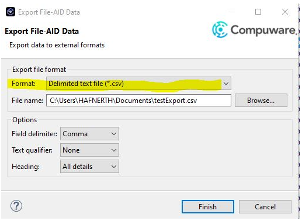

## Liens directs 

?>[AMI DevX](https://community.bmc.com/s/topic/0TO3n000000FWZmGAO/bmc-ami-devx?tabset-19d80=812de) | [Abend-AID](https://community.bmc.com/s/topic/0TO3n000000RjuQGAS/bmc-ami-devx-abendaid) | [DevEnterprise](https://community.bmc.com/s/topic/0TO3n000000RjuRGAS/bmc-ami-devx-deventerprise) | [File-AID](https://community.bmc.com/s/topic/0TO3n000000RjuSGAS/bmc-ami-devx-fileaid) | [Code Pipeline](https://community.bmc.com/s/topic/0TO3n000000RjuTGAS/bmc-ami-devx-code-pipeline) | [Workbench for Eclipse](https://community.bmc.com/s/topic/0TO3n000000RjuVGAS/bmc-ami-devx-workbench-for-eclipse) | [Workbench for VS Code](https://community.bmc.com/s/topic/0TO3n000000SYbcGAG/bmc-ami-devx-workbench-for-vs-code) | [Code Debug](https://community.bmc.com/s/topic/0TO3n000000RjuWGAS/bmc-ami-devx-code-debug) | [zAdviser](https://community.bmc.com/s/topic/0TO3n000000RjuXGAS/bmc-ami-zadviser?tabset-19d80=812de)

Pour proposer des idées et co-construire des idées avec la communauté : [Idées de la communauté](https://github.com/bmcsoftware/fr_devx_community/discussions/categories/ideas)

## Liste des Idées Actives

?>Dernière mise à jour 10/03/2025

### DevX

| Titre | Description | Votes | Statut | Date de Création |
|:-|:-|:-:|:-:|:-:|
| [CWDDALLU: provide a fix for interoperability with multi-volume SMS storage class](https://community.bmc.com/s/idea/087cx000001QlvZAAS/detail) | I request a fix to enable interoperability of CWDDALLU (EXPORT/DIRS/IMPORT - reports & source listings) with a multi-volume SMS storage class.   Even though a dataset may span up to 20 volumes due to their multi-volume SMS storage class, they usually only span a single volume, but there have been cases where a dataset has been split across two volumes... | 3 | New | 02/12/2024 |
| [CWDDALLU/IMPORT/TODD Provide a way to keep/reuse the allocates of the databases](https://community.bmc.com/s/idea/087Kj0000001Lj1IAE/detail) | I request a way to keep/reuse the allocates of the databases without them being freed/reallocated during each import command.   On z/OS, when a dynamic database allocation is performed at a JCL step, the JESYSMSG trace includes one IGD103I line and one IGD104I line... | 2 | Declined | 22/08/2024 |
| [Use of Abend-Aid/Xpediter on a program whose source listing is in DWARF format](https://community.bmc.com/s/idea/087Kj0000001LT3IAM/detail) | The Cobol compiler is now able to produce a "source listing in Dwarf format", a format widely used under UNIX.  The dwarf format may be put in a PDSE.  If CWDDALLU/Abend-Aid/Xpediter could read dwarf format, it would allow replacing source VSAMs (SHRDIR and DBs) with PDSEs, which could be easier to administer than VSAMS (there is no known barrier limiting the number of members a PDSE could accommodate). | 5 | Not Planned (18 Months) | 17/07/2024 |
| [Small additions to CWDDALLU to make it easier to empty and detach an old databas](https://community.bmc.com/s/idea/087Kj0000001LS0IAM/detail) | To make it easier to empty and detach an old database I wish a "SUM OF SIZE(K)" property under DIR, a new "TOP=n" option to select the oldest sources listing in a database, a new new "AVAILABLE ALLOCATION K" under DIRX, and a new option "UNIT=K" under DIRX... | 5 | In-Plan (18 Months) | 15/07/2024 |
| [On a list of files, add the dates columns in the contents view](https://community.bmc.com/s/idea/0873n000000Tl7TAAS/detail) | From the Host Explorer, on a list of files (from a filter), add the dates columns (creation, reference) in the contents view, to be able to sort the list on those columns.  The whole content of the "Properties" view" (or of the "Data Set Information" screen in TSO) must be able to be found (optionally) in the "Contents view". | 4 | Active | 28/10/2022 | 

### Abend-AID

| Titre | Description | Votes | Statut | Date de Création |
|:-|:-|:-:|:-:|:-:|
| [AbendAID Webhook - enhance visibility](https://community.bmc.com/s/idea/087cx000002M5j3AAC/detail) | Actually, when you create a webhook for abend-aid, it's impossible to know on when lpar is linked.  If it's activated or if it's attached to multiples lpar   It's need to have a better way to manage abend-aid webhook. Actually, it's too poor to manage it correctly | 1 | In-Plan (18 Months) | 05/03/2025 |
| [Abend-AID webhook - trap all duplicate (dup deleted also)](https://community.bmc.com/s/idea/087Kj0000001LmUIAU/detail) | If you have activated the delete duplicate in abend-aid (you didn't need to have a report each time the same abend occur) and you want to have an abend-aid webhook triggered, it's impossible, actually. You need to keep all the abend-aid report and didn't remove the duplicate.   As, if you have a duplicate, the abend-aid report block you have in the jes ouput point to the first report, for me, it's also possible to have a webhook triggered. | 1 | New | 04/09/2024 |
| [Abend-AID webhook - impossible to trap *all* the abend-aid report](https://community.bmc.com/s/idea/087Kj0000001LmPIAU/detail) | Actually, when you want to add a abend-aid webhook to trap all the abend that can occur on an lpar (example: trap all the production abend), it's impossible.  You can have a filter on the program name like A*, B*, ... but no "*" only.   Is it possible to add this functionnality? | 1 | In-Plan (18 Months) | 04/09/2024 |
| [Make possible the automatic recompilation of missing source listings](https://community.bmc.com/s/idea/087Kj0000001LTDIA2/detail) | If automatic recompilation of missing source listings was possible, we might avoid keeping some unused previous versions of source listings... | 3 | New | 17/07/2024 |
| [Add JES output in Abend-AID report](https://community.bmc.com/s/idea/087Kj0000001JgWIAU/detail) | Actually, we have a tool that capture the JES output of and abended program?  We try to use Abend-AID to replace this homemade tool. But, we didn't see any capability to capture the JES output when abend-aid take the hand.   So, for me, it's something relevant to have access to the jes output when something wrong happen.  Can we have a capability to save the jes output somewhere? Maybe in another dataset than the DDIO. | 2 | In-Plan (18 Months) | 03/06/2024 |
| [Match Storage of an SVC dump to the TGT, CEE , working storage cobol program](https://community.bmc.com/s/idea/0873n000000LiXnAAK/detail) | When we took a console dump or have an SVC dump, it will be useful to map "DSECT" TGT and CEE of a Cobol program. Also same problem for the working storage.  On listing compilation of the Cobol program whe have the definition of this different eye catcher and working storage definition.  The idea is to match Storage of the dump to the eye catcher TGT and CEE description fields, so we can know easily the working storage size, where are located different storage etc ... | 3 | In-Plan (18 Months) | 13/12/2023 | 
| [Better ESS integration with Abend-AID and ISPW](https://community.bmc.com/s/idea/0873n000000LiWzAAK/detail) | We have a question and no answer :) for our AAviewer.   If you want to check an old abend-aid report and the load is recompiled, it's impossible to do it.... Trying to force the ESS listing of the current load is not possible.  The only solution you have for now is: https://community.bmc.com/s/idea/0873n000000Tf8BAAS/detail.   But, in this case, you need to do manually the lock of the abend-aid to save the load module. What happens if you didn't lock it? You lose this capability.   After a discussion with the support, the only solution actually is to create a new DDIO file and store the ESS listing in it when you deploy a load. So... you have a copy of the ESS inside the load and n copy inside another DDIO. At the end, per LPAR, you can have from 2 to n time the space consumed by the DDIO/ESS space. Another problem is... what is the benefit of ESS if you need to export this information to keep it valuable?   One solution I see (for my use case), is the fact that we also have ISPW. AA can ask ISPW the load module from the warehouse and, send it. More link between AA and ISPW can be a very huge benefit! | 2 | Not Planned (18 Months) | 12/12/2023 | 
| [Display wrong memory address](https://community.bmc.com/s/idea/0873n000000LiUZAA0/detail) | According case : A1694947.  I capture and SVC dump and want to analyze this dump with abendaid rather than IPCS.  If the address is a 31 byte address but the cursor field point at 24 bytes address or less, so Abendaid displays the content of memory at 24 byte address and not 31 bytes address.   This is certainly normal, but a small warning would be welcome to avoid confusion for user.   I understand that it is historical but I don't understand why to display a 24 bytes memory when the address is 31 bytes. | 3 | Delivered | 30/11/2023 | 
| [$$CWINST : Ask for Version, Timestamp or ID on installer $$CWINST](https://community.bmc.com/s/idea/0873n000000DL7uAAG/detail) | To be sure to have to download, or not, the installer $$CWINST, it would be usefull to be able to identify it (version, Timestamp YYQQQ, or else) so we know whether the generated JCLs will provide us the last level of the maintenance or products (for any BMC DEVX products, Common code, Abend-Aid, File-Aid, Strobe, etc). Thanks you all | 1 | Active | 07/09/2023 | 
| [Custom INFO parameter for Action Definitions](https://community.bmc.com/s/idea/0873n000000TfJhAAK/detail) | When a CICS DUMP is trapped by Abend-Aid, you can configure in Abend-Aid the possibility of triggering a job (Action Definition Menu).  This allows for example to warn the owner of the program and invite him to consult the Abend-Aid report. We use the INFO parameter for that.  In the "Action Definition Menu" part, it is possible to customize the job card, the PROC to be executed but not the INFO parameter.  This INFO parameter contains the main characteristics of the DUMP report (Job Name, Abend Code, Tran, Program, ...) but it lacks a characteristic which is the "calling program" (called LOAD MODULE in Abend-Aid Viewer).  This feature is essential for CICS DUMPs under LE. Without this information on the "calling program", we cannot determine the owner of the business program because the program in the case of a CICS DUMP under "LE" is generic.   The request is to be able to customize this INFO parameter with the characteristics available to Abend-Aid (including the calling program "(LOAD Module)).  For more information: Case 01200861 | 2 | Active | 02/04/2021 | 
| [Abend-Aid Export parameters in a sequential dataset](https://community.bmc.com/s/idea/0873n000000TfGnAAK/detail) | Abend-Aid Enhancement (CWE-143642).  We would be interested in a request for improvement. That we can access (and modify) at least the parameters related to the DUMP Capture without the Viewer.   By an export, import mechanism or that these parameters are directly accessible in a sequential file (parmlib). | 3 | Active | 24/04/2020 | 

### DevEnterprise

| Titre  | Description | Votes | Statut | Date de Création |
|:-|:-|:-:|:-:|:-:|
| [HCI PURGE is not precise](https://community.bmc.com/s/idea/0873n000000TfGHAA0/detail) | When you use HCI PURGE,ENQ=[PDS], you can't specify a specific member.  At the end, when you have only one file blocked, you "kill" all the enqueue on all the opened file in this PDS.   Can you add 2 possiiblities:  1. PURGE ENQ=SOMETING(FILE)   2.PURGE USER=USERID.   First one to purge an enqueue on a specific file.  Second one to purge all the enqueue for a specific user | 4 | Active | 21/10/2020 | 
| [Modernize DevEnterprise GUI](https://community.bmc.com/s/idea/0873n000000Tf0JAAS/detail) | DevEnterprise has a very old GUI. It's not very effective and completely outside all the other Compuware ecosystem. Can you provide a Topaz perspective for this tools, and modernize the look and feel. | 4 | Not Planned (18 Months) | 11/12/2019 | 

### File-AID

| Titre  | Description | Votes | Date de Création |
|:-|:-|:-:|:-:|
| [New export formats: .xlsx and .txt on File-AID](https://community.bmc.com/s/idea/087Kj0000001I7nIAE/detail) | Hi, We would like to have two new export formats in File-aid (on files) :.xlsx and .txt.      We have several requesting users. Thank| 3 | 16/05/2024 | 
| [upgrade File-aid to specify octet of begining to read on a row.](https://community.bmc.com/s/idea/0873n000000LicEAAS/detail) | Hi BMC community,    I want to suggest an evolution :   I have a copy and I want to read a file with this mapping. But the copy doesn't match completely with the file. (the file's got 100 octets previous on each row)   So I search a way with File Aid to skip the first 100octet ....and File Aid doesn't allow me to do that :'( (Or I didn't get it with XREF or other) (Yes, I could rebuild my file, or create an other copy who encapsulate my first one. but it's a contournement)  Furthermore, this evolution could also, -Skip octets at the begining -Show unformated begenning octets and Start the mapping after -Concate two or more copy to describe a file -Omit some other octet inside or at the end, in the way to match the copy with the file   Maybe this evolve could be shown in the panel Options in topaz      and on TSO on this panel (like the Quick option)    | 1 | 10/01/2024 | 
| [Integration between File-AID and Code Pipeline](https://community.bmc.com/s/idea/0873n000000LiV8AAK/detail) | I have 2 kinds of use case in my mind for this kind of integration.  FA/MVS:  If you want to use FA/MVS and a copybook to read a file, you need to have it on the LPAR. But, if you have Code Pipeline, the source is not deployed, it stays inside Code Pipeline repository, maybe in another LPAR.  FA/IMS: Same problem for the DL1 copybook.   Actually, the only solution is to deploy the source on every lpar, so it's not very efficient. If we can have a link between Code Pipeline and ISPW, we can say "use this copybook to read this file", and the file is taken from the repository and use to do the operation.| 1 | 4/12/2024 | 
| [RDX LOAD SQL INSERT/UPDATE with temporal table](https://community.bmc.com/s/idea/0873n00000054SPAAY/detail) | RDX LOAD SQL INSERT/UPDATE with temporal table  | 4 | 14/06/2023 | 
| [HCI/Data Studio/File-AID: Group of CXSS* STC instead of dynamic CXSS* STC](https://community.bmc.com/s/idea/0873n000000Tf0uAAC/detail) | Currently, several hundred (thousand) CXSS* STC are launched dynamically per day to do File-Aid via Topaz  Another option would be to have a permanent STC group in LPAR (variable managed by a parameter). This would reduce CPU consumption and facilitate LPAR management | 3 | 04/02/2020 | 

### Code Pipeline

| Titre  | Description | Votes | Date de Création |
|:-|:-:|:-:|:-:|
| [Titre](Lien) | Description | Votes | Date | 

### Workbench for Eclipse

| Titre  | Description | Votes | Date de Création |
|:-|:-:|:-:|:-:|
| [Titre](Lien) | Description | Votes | Date | 

### Workbench for VS Code

| Titre  | Description | Votes | Date de Création |
|:-|:-:|:-:|:-:|
| [Titre](Lien) | Description | Votes | Date | 

### Code Debug

| Titre  | Description | Votes | Date de Création |
|:-|:-:|:-:|:-:|
| [Titre](Lien) | Description | Votes | Date | 

### zAdviser

| Titre  | Description | Votes | Date de Création |
|:-|:-:|:-:|:-:|
| [Titre](Lien) | Description | Votes | Date | 